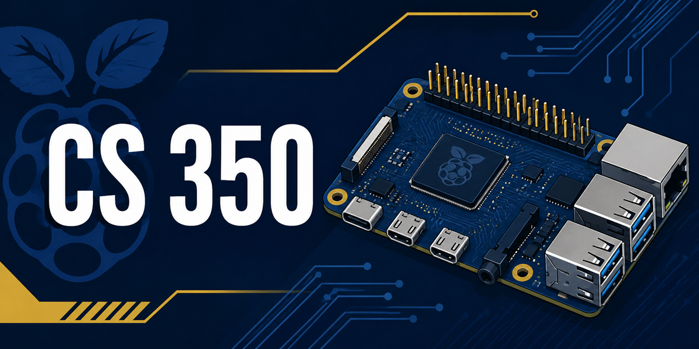

# CS 350 – Raspberry Pi Repository


<!-->
## ⚠️ Under Construction

This repository is incomplete and under active development. Code, documentation, structure, and features may change frequently. Use with caution, and check back for updates.
-->
## Prerequisites

Before you use this repository, complete these tasks:

1. Assemble your Raspberry Pi.
2. Create the bootable microSD card.
3. Power on your Raspberry Pi.
4. Connect your Raspberry Pi to the same network as your main computer.

## Getting Started

Follow these steps from a terminal window on your main computer. First, you will connect to your Raspberry Pi using Secure Shell (SSH). SSH lets you use your Raspberry Pi command line from another computer on the same network. After you connect, the setup commands will run directly on the Raspberry Pi.

**1. Connect to your Raspberry Pi.** Open a terminal on your main computer and run the command below. If you have not changed the default settings, copy the following command and paste it into your terminal. If you changed the example username or hostname, replace `stu` with your username and `rpi` with your hostname, and type the command accordingly:

```bash
ssh-keygen -R rpi
ssh-keygen -R rpi.local
ssh stu@rpi.local
```

If this is your first time connecting to the Raspberry Pi, you may be asked to accept the Raspberry Pi SSH host key. Type `yes` to accept and continue. The host key helps your computer recognize that it is connecting to the same Raspberry Pi in the future.

You will then be prompted to enter the password for your Raspberry Pi user account. The cursor will not move as you type the password. After you enter the password, press `Enter` to continue. If the username, hostname, or password are incorrect, you will see an error message and will need to try again.

> *Note.* Use the hostname, username, and password values you set in **Raspberry Pi Imager** when you created the bootable microSD card. If you do not have this information, open the **Raspberry Pi Imager** and follow the instructions to get to the Customization section. It should have saved your settings. If not, you will need to run the imager again on your microSD card. Be sure to note the hostname, username, and password for future use.

**2. Download the repository files and run setup.** After you connect to your Raspberry Pi and have a prompt that looks like `stu@rpi:~$`, copy all the commands below to your clipboard--just click the **Copy** button on the right for the code block below. Then, paste the following commands into the Raspberry Pi terminal prompt.

These commands will install Git, temporarily download the latest project dependencies, and execute the automated setup environment configuration utility.

```bash
sudo apt update && sudo apt install -y git
git clone https://github.com/GC-STEM/cs350-rpi.git /tmp/cs350-rpi
chmod +x /tmp/cs350-rpi/scripts/setup_rpi.sh
/tmp/cs350-rpi/scripts/setup_rpi.sh

```

After the interactive script finishes executing, it will copy the files into place. If you run `tree -L 2` on your Raspberry Pi home directory (`~/`), you should see these sub-directories and files, albeit without the comments shown below:

```text
~/
├── cs350/                # Course materials for CS 350
│   ├── m1/               # Module 1 | Assignment: Prepare Your Raspberry Pi
│   ├── m2/               # Module 2 | Milestone 1: PWM Lab
│   ├── m3/               # Module 3 | Milestone 2: UART Lab
│   ├── m4/               # Module 4 | Assignment: Wiring LCD
│   ├── m5/               # Module 5 | Milestone 3: Button Input Lab
│   ├── m6/               # Module 6 | Assignment: Add Sensor
│   ├── m7/               # Module 7 | Final Project: Thermostat Lab
│   └── requirements.txt  # Course Python dependencies
│
├── rpilib/               # Reusable Python library for RPi projects
│   ├── comms/            # Package for communication helper modules
│   ├── config.py         # Module for shared default settings and constants
│   ├── displays/         # Package for display device helper modules
│   ├── gpio/             # Package for GPIO helper modules
│   ├── __init__.py       # Initialize the main rpilib package
│   ├── sensors/          # Package for sensor device helper modules
│   ├── testing/          # Package for testing that does not require hardware
│   └── timing.py         # Module for shared timing values and timing helpers
│
└── scripts/              # Reusable Raspberry Pi shell scripts
    ├── setup_rpi.sh      # Set up Raspberry Pi environment
    ├── smoke_rpi.sh      # Run smoke tests on Raspberry Pi
    └── update_rpi.sh     # Update Raspberry Pi environment
```

> *Note.* This repository and your RPi home directory includes hidden files and directories not listed in this directory structure. These files support maintenance, documentation, testing, or automatic virtual environment activation. Do not modify those hidden assets. Focus your coding tasks inside the standard course directories listed above.

## Troubleshooting

{{TODO: Add more troubleshooting items as they arise during testing.}}

| Issue | Potential Cause | Resolution |
| --- | --- | --- |
| `ssh: Could not resolve hostname rpi.local` | Network mismatch or Pi is booting. | Ensure your main computer and Raspberry Pi are on the exact same Wi-Fi/local network. Wait 60 seconds and try again. |
| Warning: `Existing course folders were found` | Re-running the script mid-semester. | **Choose Option 2** if you want to fix your tools or virtual environment without overwriting your programming assignments. |
| `requirements.txt not found locally` | Broken file transfer state. | The script will automatically pull a secure fallback file straight from GitHub. Let the script continue running. |

## AI Acknowledgment

This repository structure, including its automated environment deployment scripts, was developed and tested using a combination of foundational course architectures and generative AI assistance to maximize system reliability, provide defensive file-backup checkpoints, and establish strict classroom reproducibility standards.
